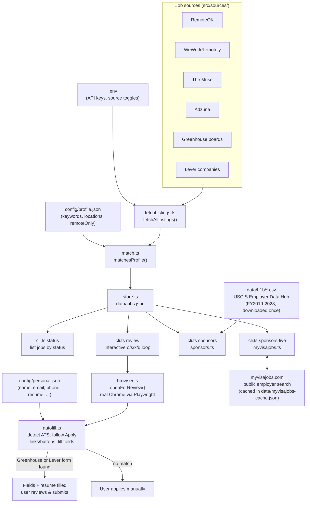

# job-agent

A personal CLI that finds software engineering jobs matching your profile, tracks
them locally, and helps you apply — including autofilling Greenhouse/Lever
application forms and cross-checking companies against H-1B sponsorship history.

Nothing is ever submitted on your behalf: every application is opened in a real,
visible browser window for you to review and submit yourself.

## Architecture



## How it works

1. **Fetch** — `fetchListings.ts` pulls job postings in parallel from whichever
   sources are enabled: RemoteOK, WeWorkRemotely and The Muse (on by default),
   Adzuna (needs a free API key), and any Greenhouse/Lever company boards you list.
2. **Match** — each listing is filtered through `match.ts` against
   `config/profile.json`: required keywords, excluded keywords, location
   substrings, and an optional remote-only filter.
3. **Store** — new matches are written to `data/jobs.json` via `store.ts`, each
   tagged with a status (`new` → `interested`/`skipped` → `applied`, plus
   `interview`/`rejected`/`offer` for manual tracking later).
4. **Review** — `npm run review` walks through your `new` jobs one at a time,
   **senior → lead → principal → everything else**, newest-posted-first within
   each tier. For each job you choose to open, save, skip, or quit.
5. **Apply** — opening a job launches your real installed Chrome (via
   Playwright, with anti-bot-detection flags set) to the listing. `autofill.ts`
   then:
   - follows the page straight through if it's already a Greenhouse/Lever URL,
   - or looks for a real `<a href>` "Apply" link pointing at one of those ATS
     platforms,
   - or clicks a JS-driven "Apply" button (common on Muse/WWR/RemoteOK/Adzuna)
     and follows the resulting new tab.

   If it lands on a Greenhouse or Lever form, it fills in your name, email,
   phone, LinkedIn, current company, and uploads your resume from
   `config/personal.json` — then stops. It never clicks submit. Anything else
   (Workday, custom company career pages, etc.) is left for you to fill in
   by hand.
6. **Sponsor checks** (optional, informational only):
   - `npm run sponsors` cross-references tracked companies against the
     official [USCIS H-1B Employer Data Hub](https://www.uscis.gov/tools/reports-and-studies/h-1b-employer-data-hub)
     (FY2019–2023 petition data, downloaded once into `data/h1b/`).
   - `npm run sponsors:live` cross-references against myvisajobs.com's public
     employer search (rolling last-3-fiscal-years), caching results in
     `data/myvisajobs-cache.json` so repeat runs don't re-hit their server.

   Both match by company name only — treat results as a lead to verify, not a
   guarantee.

## Setup

```bash
npm install
npx playwright install chromium   # only needed once
cp .env.example .env
cp config/profile.example.json config/profile.json
cp config/personal.example.json config/personal.json
```

Then edit:
- **`.env`** — enable/disable sources, add `GREENHOUSE_BOARDS` / `LEVER_COMPANIES`
  (comma-separated company slugs) and, optionally, a free
  [Adzuna API key](https://developer.adzuna.com) for much broader US coverage.
- **`config/profile.json`** — your search keywords, excluded keywords,
  locations, and whether to require remote.
- **`config/personal.json`** — your contact info and resume path, used only for
  autofill. Leave any field blank to skip filling it.

All three of these, plus everything under `data/`, are gitignored — none of
your personal data, resume path, or job-tracking history is ever committed.

## Commands

| Command | Does |
|---|---|
| `npm run search` | Fetch new listings, filter against your profile, store matches, then review anything new |
| `npm run status` | List all tracked jobs, grouped by status |
| `npm run review` | Interactively review/apply to jobs still at `new` |
| `npm run sponsors` | Check tracked companies against USCIS H-1B data |
| `npm run sponsors:live` | Check tracked companies against myvisajobs.com (live, cached) |
| `npm run typecheck` | Type-check with `tsc --noEmit` |

## Notes & caveats

- Autofill only recognizes **Greenhouse** and **Lever** — the two ATS platforms
  with predictable, well-structured forms. It never submits an application.
- The "follow an Apply button" logic clicks the first *visible* element whose
  text starts with "Apply"; on unfamiliar sites, double-check it landed
  somewhere sensible before trusting the autofilled fields.
- Sponsor-check results are name-matches against third-party/government data,
  not legal guarantees — recruiter/staffing-agency names and near-duplicate
  company names can produce false positives or negatives.
